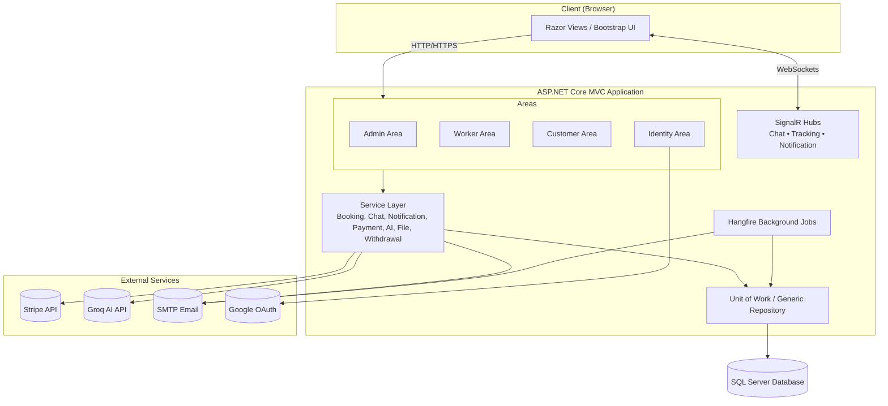
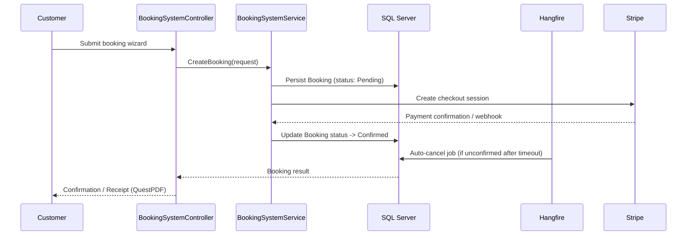

# 🛠️ Shatbly — Home & Domestic Services Booking Platform

<div align="center">

**A secure, real-time, multi-role home services booking ecosystem built on ASP.NET Core MVC.**

[](https://dotnet.microsoft.com/)
[](https://dotnet.microsoft.com/apps/aspnet)
[](https://learn.microsoft.com/ef/core/)
[](https://www.microsoft.com/sql-server)
[](https://dotnet.microsoft.com/apps/aspnet/signalr)
[](https://www.hangfire.io/)
[](https://stripe.com/)
[](#license)

</div>

---

## 📖 Project Description

**Shatbly** (project codename `Shtbly`) is an ASP.NET Core MVC (.NET 9) web application that connects **customers** with **service workers** (technicians/handymen) for on-demand home services — plumbing, electrical work, cleaning, and similar domestic jobs. The platform is built with a **modular monolith** architecture using Entity Framework Core, ASP.NET Identity, and a real-time layer powered by SignalR.

It supports three distinct role-based portals — **Super Admin / Admin**, **Worker**, and **Customer** — each with dedicated controllers, views, and workflows, plus a full booking lifecycle: service discovery, scheduling, in-app chat, live GPS tracking, Stripe-based payments, wallet/withdrawal management, ratings & reviews, and dispute resolution.

> This README is generated directly from the repository's source structure and code. It documents what is implemented, not aspirational features.

---

## 📑 Table of Contents

- [Features](#-features)
- [Tech Stack](#-tech-stack)
- [Architecture Overview](#-architecture-overview)
- [Folder Structure](#-folder-structure)
- [Installation](#-installation)
- [Configuration](#-configuration)
- [Usage](#-usage)
- [API & Real-Time Overview](#-api--real-time-overview)
- [Database Overview](#-database-overview)
- [Authentication & Authorization](#-authentication--authorization)
- [Screenshots](#-screenshots)
- [Roadmap](#-roadmap)
- [Contributing](#-contributing)
- [License](#-license)
- [Author](#-author)
- [Contact](#-contact)

---

## ✨ Features

### 🔑 Core Platform
- **Multi-Area architecture** — separate `Admin`, `Customer`, `Worker`, and `Identity` areas, each with isolated controllers and views.
- **Role-based access control** (Super Admin, Admin, Worker, Customer) with custom Access Denied handling and route/action-level `[Authorize(Roles = ...)]` policies.
- **ID Obfuscation** via Hashids (`HashidOutboundParameterTransformer`) — raw database IDs are never exposed in URLs.
- **Localization (i18n)** — full English/Arabic support with RTL-aware views (`.ar.resx` / `.en.resx` resource files across controllers and views) and a culture-switching controller.

### 📅 Booking System
- Multi-step, session-based **booking wizard** (`BookingWizardViewModel`) for customers.
- Coupon and promo-code discount engine (`Coupon`, `Promotion`, `PromotionCode`).
- Automated **Hangfire background job** to auto-cancel unconfirmed bookings.
- Booking status pipeline: `Pending → Confirmed → InProgress → Completed / Cancelled / Disputed`.
- Admin, Worker, and Customer booking management views with pagination and search/filtering.

### 💬 Real-Time Engine (SignalR)
- **ChatHub** — bidirectional, connection-authorized messaging between customer and worker per booking.
- **TrackingHub** — live GPS telemetry for en-route workers.
- **NotificationHub** — instant, refresh-free UI notifications.

### 💳 Payments & Wallet
- **Stripe** integration for checkout sessions and webhook-based payment validation.
- Internal **virtual wallet** ledger (`Wallet`, `WalletTransaction`).
- **Withdrawal request** workflow with admin approval/rejection (`WithdrawalController`, `WithdrawalService`).
- **QuestPDF**-generated, localized PDF receipts and admin reports.

### 🤖 AI & Support
- **Groq AI (LLM)** powered customer-support chat assistant (`GroqChatService`).
- AI-assisted **ID/CV validation** service for worker onboarding.

### 👷 Worker Experience
- Availability & unavailability (blackout date) scheduling.
- Portfolio media upload service.
- Earnings dashboard and withdrawal requests.
- CV & ID-card submission and admin vetting/approval flow (auto-confirms email upon approval).

### 🙋 Customer Experience
- Service discovery, favorites, and worker details pages.
- Review & rating system with automatic worker rating recalculation.
- Dispute raising against a booking, mediated by Admin.

### 🛡️ Admin / Super Admin
- Central **dashboard** with Chart.js visualizations (orders over time, user distribution, service usage).
- User, worker profile, service category, coupon, promotion, banner, and dispute management.
- **Messages Center** — pending worker applications, direct messaging/notifications, sent-message history, and inbox.
- **Reports** module with revenue, booking, and service-performance analytics.
- **Health Checks UI** (`/health-ui`) — monitors SQL Server, CRUD ops, DI, external APIs (Stripe/Groq), Hangfire, and more — restricted to Admins or local requests.
- **Hangfire Dashboard** protected by a custom authorization filter.
- Admin self-service **account settings** (profile & password management).

### 🔒 Security
- **Zero-trust minded**: global Anti-CSRF token validation (`AutoValidateAntiforgeryTokenAttribute`), HTML encoding, and strict file upload validation (extension whitelist + size limits).
- ASP.NET Identity with configurable password/lockout policies and **Google OAuth** external login.
- JWT token issuance available alongside cookie-based authentication (`TokenService`, `TokenController`).

---

## 🧰 Tech Stack

| Layer | Technology |
|---|---|
| **Framework** | ASP.NET Core MVC (.NET 9) |
| **ORM** | Entity Framework Core 9 (SQL Server) |
| **Identity & Auth** | ASP.NET Core Identity, Google OAuth, JWT Bearer |
| **Real-Time** | SignalR (Chat, Tracking, Notifications) |
| **Background Jobs** | Hangfire (SQL Server storage) |
| **Payments** | Stripe.net |
| **AI** | Groq API (LLM chat assistant) |
| **PDF Generation** | QuestPDF |
| **Health Monitoring** | AspNetCore.HealthChecks (SQL Server, custom checks) + HealthChecks UI |
| **Localization** | Microsoft.AspNetCore.Localization (English / Arabic, RTL support) |
| **Frontend** | Razor Views (MVC), Bootstrap-based admin dashboard, Chart.js, SweetAlert2 |
| **ID Security** | Hashids (custom route value transformer) |

---

## 🏗️ Architecture Overview

Shatbly follows a **modular monolith** pattern: a single deployable ASP.NET Core application internally organized into isolated **Areas**, a **Repository + Unit of Work** data layer, and a **Service layer** encapsulating business logic — keeping controllers thin and testable.



### Request Flow — Booking Lifecycle Example



---

## 📁 Folder Structure

```
Shtbly/
├── Areas/
│   ├── Admin/            # Super Admin & Admin portal (Controllers + Views)
│   ├── Customer/         # Customer-facing portal
│   ├── Identity/         # Auth (Login, Register, OTP, external login)
│   └── Worker/           # Worker portal
├── Controllers/          # Root-level controllers (Culture, Test)
├── DataAccess/
│   ├── ApplicationDbContext.cs
│   └── Migrations/       # EF Core migrations
├── HealthCheck/          # Custom IHealthCheck implementations
├── Hubs/                 # SignalR hubs (Chat, Notification, Tracking)
├── Models/                # EF Core entities (Booking, User, Payment, Wallet, etc.)
├── Reports/               # QuestPDF report generators
├── Repositories/          # Generic Repository + Notification repository
├── Resources/              # .resx localization files (en/ar) per controller/view
├── Services/
│   ├── AI/                 # Groq chat + ID validation
│   ├── AvailabilityService/
│   ├── BookingSystem/
│   ├── Chat/
│   ├── CurrentWorkerService1/
│   ├── File Service/
│   ├── Hangfire/           # Background job scheduling
│   ├── Notification/       # Email, SMS, in-app notifications
│   ├── Portfolio/
│   ├── Receipt/
│   ├── TokenServices/
│   ├── WithdrawalService/
│   └── WorkerProfileService/
├── UnitOfWork/
├── Utilities/               # SD (static defaults), Hashid providers, Email sender
├── ViewComponents/
├── ViewModels/
├── Views/                   # Shared layout, home, shared partials
├── wwwroot/                 # Static assets (css, js, images)
├── appsettings.json
├── Program.cs                # Application entry point & DI configuration
└── Shtbly.csproj
```

---

## ⚙️ Installation

### Prerequisites
- [.NET 9 SDK](https://dotnet.microsoft.com/download)
- SQL Server / SQL Server LocalDB
- (Optional) Node.js — only required for the `scratch/presentation` slide-generation script

### Steps

```bash
# 1. Clone the repository
git clone https://github.com/<your-org>/Servers-Booking-Platform.git
cd Servers-Booking-Platform

# 2. Restore .NET dependencies
cd Shtbly
dotnet restore

# 3. Apply EF Core migrations
dotnet ef database update

# 4. Run the application
dotnet run
```

The app will be available at `https://localhost:7282` (as configured in `appsettings.json` / `launchSettings.json`).

---

## 🔧 Configuration

All configuration lives in `appsettings.json` / `appsettings.Development.json`. **Never commit real secrets** — use `dotnet user-secrets` or environment variables in production.

```json
{
  "ConnectionStrings": {
    "DefaultConnection": "Data Source=(localdb)\\ProjectModels;Initial Catalog=Shatably;..."
  },
  "Smtp": {
    "Host": "smtp.gmail.com",
    "Port": 587,
    "EnableSsl": true,
    "UserName": "",
    "Password": "",
    "FromEmail": "",
    "FromName": "Shtbly"
  },
  "Authentication": {
    "Google": { "ClientId": "", "ClientSecret": "" }
  },
  "Stripe": { "SecretKey": "" },
  "GroqApi": { "ApiKey": "", "Model": "llama-3.3-70b-versatile" },
  "Jwt": { "Issuer": "", "Audience": "", "SigningKey": "" },
  "App": { "BaseUrl": "" },
  "Seed": { "CreateDemoUsers": false, "DemoPassword": "" }
}
```

| Setting | Purpose |
|---|---|
| `ConnectionStrings:DefaultConnection` | SQL Server connection string |
| `Smtp:*` | Outbound email (email confirmation, notifications, OTP) |
| `Authentication:Google` | Google OAuth external login |
| `Stripe:SecretKey` | Stripe payment processing |
| `GroqApi:ApiKey` / `Model` | AI chat assistant |
| `Jwt:*` | JWT issuance for API/token-based auth flows |
| `Seed:CreateDemoUsers` | Seeds demo accounts on startup (via `Dbintialize`) |

> ⚠️ The tracked `appsettings.json` in this repository contains a live-looking SMTP credential pair. **Rotate/remove any real secrets before making this repository public.**

---

## 🚀 Usage

Once running, the application exposes distinct entry points per role:

- **Customer** — browse and book services, chat with assigned workers, track live location, manage wallet & reviews.
- **Worker** — accept jobs, manage availability, upload portfolio, view earnings, request withdrawals.
- **Admin / Super Admin** — `/Admin/Home` dashboard for platform-wide analytics, user/worker/service management, dispute mediation, and messaging.
- **Hangfire Dashboard** — `/Hangfire` (Admin-authorized) for monitoring background jobs (e.g., booking auto-cancellation).
- **Health Checks UI** — `/health-ui` (Admin-authorized) for live system diagnostics.

---

## 🔌 API & Real-Time Overview

### SignalR Hubs

| Hub | Route | Purpose |
|---|---|---|
| `ChatHub` | `/chatHub` | Booking-scoped chat between customer & worker |
| `TrackingHub` | `/trackingHub` | Live GPS location streaming |
| `NotificationHub` | `/hubs/notifications` | Real-time in-app notifications |

### Key Health/System Endpoints

| Endpoint | Access | Description |
|---|---|---|
| `GET /health` | Admin / Local only | Lightweight JSON health status |
| `GET /health-api-json` | Admin / Local only | Full UI-formatted health report |
| `GET /health-ui` | Admin only | Health Checks dashboard |
| `/Hangfire` | Admin only | Background job dashboard |

### Notable MVC Areas (route pattern: `/{Area}/{Controller}/{Action}/{id?}`)

- `Admin/Booking`, `Admin/User`, `Admin/WorkerProfile`, `Admin/Coupon`, `Admin/Promotion`, `Admin/Dispute`, `Admin/Report`, `Admin/Messages`
- `Worker/Booking`, `Worker/Availability`, `Worker/Earnings`, `Worker/Portfolio`, `Worker/Withdrawal`
- `Customer/BookingSystem`, `Customer/Chat`, `Customer/Review`, `Customer/Notification`

---

## 🗄️ Database Overview

Data access uses **EF Core 9** with a **Generic Repository + Unit of Work** pattern (`IRepository<T>`, `IUnitOfWork`) for atomic, testable transactions.

### Core Entities (from `Models/`)

| Entity | Description |
|---|---|
| `User` | ASP.NET Identity user (customers, workers, admins) |
| `WorkerProfile` | Extended worker data (bio, CV, verification, rating) |
| `WorkerService` | Worker ↔ ServiceCategory pricing/availability |
| `ServiceCategory` | Catalog of service types |
| `Booking` / `BookingItem` | Booking header & line items |
| `Order` | Order/transaction record |
| `Payment` | Stripe payment record |
| `Coupon` / `Promotion` / `PromotionCode` | Discount engine |
| `Review` | Ratings & feedback |
| `Dipuste` (Dispute) | Booking disputes/complaints |
| `Wallet` / `WalletTransaction` | Internal ledger |
| `WithdrawalRequest` | Worker payout requests |
| `Notification` | In-app/system notifications |
| `ChatMessage` | Persisted chat history |
| `PortfolioMedia` | Worker portfolio uploads |
| `Avalability` / `UnAvalability` | Worker scheduling |
| `Banner` | Promotional banners |
| `OTP_Verification` | OTP-based verification flow |
| `RefereshToken` | JWT refresh tokens |
| `Address`, `Favorite`, `Referral`, `DeviceToken`, `SupportTicket`, `LogActivity` | Supporting entities |

Migrations are tracked under `DataAccess/Migrations/`, evolving from `InitialCreate` through features such as JWT tokens, admin settings, ID card photos, and profile pictures.

---

## 🔐 Authentication & Authorization

- **ASP.NET Core Identity** manages users and roles (`User : IdentityUser`), with configurable password strength, lockout, and **required email confirmation**.
- **Google OAuth** external login is conditionally enabled when client credentials are configured.
- **Cookie authentication** is the primary session mechanism (`/Identity/Account/Login`), with a **JWT** token service (`TokenService`, `TokenController`) available for API-style flows.
- **Role-based authorization** via `[Authorize(Roles = ...)]` using constants defined in `SD` (`ROLE_ADMIN`, `ROLE_SUPER_ADMIN`, `ROLE_WORKER`, `ROLE_CUSTOMER`).
- A custom **`AdminOrLocal` policy** restricts sensitive diagnostics endpoints (health checks) to authenticated admins or local/loopback requests.
- **Custom Access Denied** pages per area, and automatic role transition (Customer → Worker) upon admin approval of a worker application.

---

## 🖼️ Screenshots

> _Add screenshots or GIFs of the application here._

| Admin Dashboard | Booking Wizard | Live Chat |
|---|---|---|
|  |  |  |

| Worker Earnings | Health Checks UI | Hangfire Dashboard |
|---|---|---|
|  |  |  |

---

## 🗺️ Roadmap

- [ ] Move hard-coded secrets (SMTP credentials) out of `appsettings.json` into secure secret storage.
- [ ] Expand automated test coverage (unit/integration tests for services and controllers).
- [ ] Formalize a public REST/JWT API surface for a companion mobile app.
- [ ] CI/CD pipeline for automated build, migration, and deployment.
- [ ] Containerize with Docker for consistent environments.
- [ ] Expand AI assistant capabilities (ticket triage automation, sentiment analysis).

---

## 🤝 Contributing

Contributions are welcome! To contribute:

1. Fork the repository.
2. Create a feature branch: `git checkout -b feature/your-feature`.
3. Commit your changes: `git commit -m "Add your feature"`.
4. Push to the branch: `git push origin feature/your-feature`.
5. Open a Pull Request describing your changes.

Please ensure new features include relevant EF Core migrations and localization resources (`en`/`ar`) where applicable.

---

## 📄 License

This project is licensed under the **MIT License**. See the [LICENSE](LICENSE) file for details.

---

## 👤 Author

**Mohamed Sayed Abdelkader**
Backend .NET Developer · Computer Science Student, Cairo Higher Institute

- GitHub: [@MoSayed335](https://github.com/MoSayed335)
- LinkedIn: [mo7amed-abdelkader](https://www.linkedin.com/in/mo7amed-abdelkader)

---

## 📬 Contact

For questions, feedback, or collaboration opportunities, reach out via:

- **Email:** mabdelkader.dev@gmail.com
- **LinkedIn:** [linkedin.com/in/mo7amed-abdelkader](https://www.linkedin.com/in/mo7amed-abdelkader)
- **GitHub Issues:** [Open an issue](../../issues) on this repository
